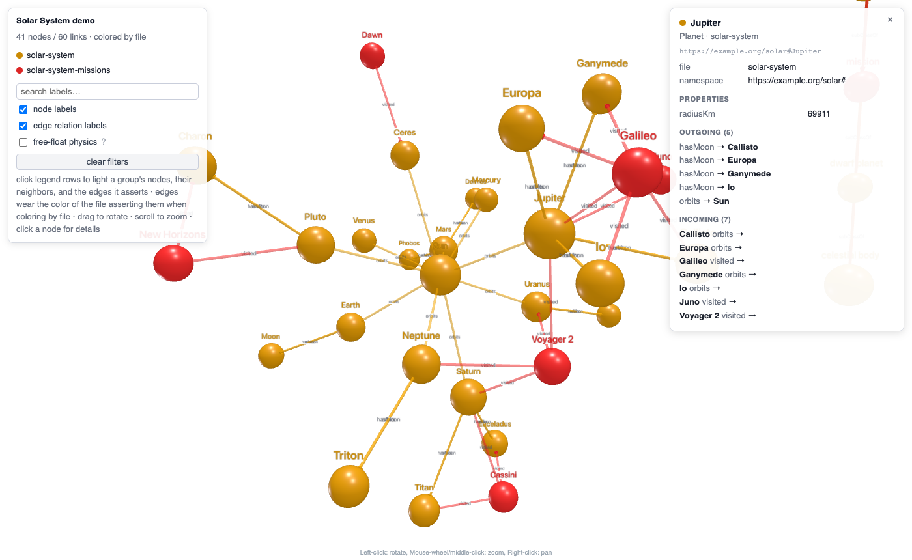

# ttl3d

[](https://github.com/soheilabadifard/TTL_to_3D/actions/workflows/tests.yml)
[](LICENSE)
[](pyproject.toml)

Turn any Turtle / RDF graph into a single self-contained HTML page with a 3D
view (shaded spheres) and a 2D view (a flat canvas), permanent labels, predicate
labels on the edges, a clickable legend, label search, and a detail card for
every node. The page embeds all of its JavaScript, so it opens from a file,
works offline, and never sends your data anywhere.



## Why

Ontology editors show class trees. SPARQL browsers show one neighbourhood at a
time. Sometimes you want the whole graph on screen at once: to see which
modules actually connect, which file asserted which edge, or which node
everything hangs from. ttl3d was written for exactly that while building a
multi-file ontology, then generalized to any RDF input.

## Install

Python 3.10 or newer.

```bash
pip install git+https://github.com/soheilabadifard/TTL_to_3D
```

Or clone the repository and run `pip install -e .`. The dependencies are
`rdflib`, `networkx`, `numpy` and `scipy`, all available on conda-forge as
well.

## Quick start

```bash
ttl3d examples/solar-system.ttl examples/solar-system-missions.ttl -o solar.html
```

Open `solar.html` in any browser. Pass several files and they merge into one
graph; the default colouring then shows which file declared each node and
which file asserted each edge.

Without installing, run the module from a clone: `python -m ttl3d ...`.

## Options

| Option | Values | Meaning |
|--------|--------|---------|
| `-o, --out` | path | Output file. Default: `<first file stem>-<view>.html` in the current directory. |
| `--color-by` | `file` (default), `type`, `namespace` | What node colours and the legend mean. In `file` mode edges also take the colour of the file asserting them. |
| `--layout` | `auto` (default), `stress`, `force` | `stress` pins every node to a precomputed Kamada-Kawai position, one layout per view (3D and 2D); `force` runs the live simulation. `auto` picks `stress` up to 1000 nodes. |
| `--labels` | `auto` (default), `always`, `hover` | Permanent label sprites. `auto` keeps node labels up to 800 nodes and edge labels up to 800 links; `hover` leaves tooltips only. |
| `--view` | `3d` (default), `2d` | Starting view. The page has a `3D \| 2D` switch either way, and each view is pinned to its own stress layout. |
| `--title` | text | Page title. Default: the first file's stem. |
| `--lang` | language tag, default `en` | Preferred language for labels and definitions. Untagged literals rank next; other languages become synonyms on the card. Matched exactly: `--lang en` does not select `@en-GB`. |
| `--format` | rdflib parser name | Force a parser for every input (`turtle`, `xml`, `nt`, `json-ld`, ...). Default: guess from the extension, then try Turtle. |
| `--type-links` | flag | Draw `rdf:type` as an edge from each instance to its class instead of listing it on the card only. |
| `--attribute-preds` | `prefix:local`, full IRI, or `<urn:...>` | Predicates to keep off the picture and show on the card, e.g. `foaf:homepage,rdfs:seeAlso`. Repeatable; wrap a URN or mailto in angle brackets. |

Input formats are guessed from the extension (`.ttl`, `.nt`, `.n3`, `.rdf`,
`.owl`, `.jsonld`, ...) through rdflib.

## What becomes a node, what becomes a link

- A node is every IRI that is the subject of some triple or the object of a
  link, except IRIs of the RDF, RDFS, OWL and XSD vocabularies and ontology
  headers (`owl:Ontology`). Blank nodes are skipped.
- A link is an IRI-to-IRI triple whose predicate is a relation. `rdf:type`,
  `owl:imports`, `owl:versionIRI`, `owl:priorVersion`, `rdfs:isDefinedBy`,
  `prov:wasDerivedFrom` and `dcterms:source` describe the node instead and go
  to its card. Parallel edges collapse into one link listing every predicate.
- Label: `rdfs:label`, else `skos:prefLabel`, else the local name.
  Definition: `skos:definition`, else `rdfs:comment`, else `dcterms:description`.
  Every other literal lands in the card's property table.
- Each node remembers the file that first declares it; each link remembers the
  files asserting it. A file that only adds edges between other files' nodes
  still owns something visible.
- An edge asserted in both directions (`:Luna :orbits :Earth` and `:Earth :hasMoon :Luna`) is one link labelled `orbits ⇄ hasMoon`, without an arrowhead.
- Labels follow `--lang`: the requested language first, then untagged literals, then anything else; every other label value becomes a synonym on the card, and a `rdfs:comment` that loses to a `skos:definition` still appears in the property table.

## In the page

- Legend rows filter inclusively: a selected group keeps its own nodes, their
  direct neighbours, and the endpoints of every edge it asserts.
- The `3D | 2D` switch rebuilds the picture in the other view. Legend filters, the
  search text and the open card carry over, and in pinned mode each view has its own
  precomputed stress layout. A browser without WebGL opens in 2D and says so.
- Search dims everything whose label does not match.
- Click a node for its card: types, file, namespace, definition, synonyms,
  properties, incoming and outgoing relations (clickable), and sources.
- The label toggles rebuild the scene, so a big graph can start without
  sprites and switch them on later.
- "Free-float physics" releases pinned nodes into the live force layout and
  pins them back where they were.
- No fog: white fog made distant nodes vanish on zoom-out.
- Past twelve groups only the eleven largest keep a colour; the rest share one grey "other" row that filters them together.

## Scale

The stress layout is quadratic in the number of nodes and label sprites are
scene objects, so the automatic modes degrade instead of freezing:

| Graph size | Layout | Labels |
|-----------|--------|--------|
| up to 800 nodes / 800 links | pinned stress layout | nodes and edges |
| up to 1000 nodes | pinned stress layout | tooltips for the layer over its threshold |
| larger | live force simulation | tooltips; switch sprites on from the panel |

The stress layout is computed twice, once per view, so a pinned page takes about
twice the layout time of 0.1.0.

Force the behaviour you want with `--layout` and `--labels`.

## Limitations

- Blank nodes are skipped, so OWL restrictions and RDF lists do not appear.
- No reasoning: only asserted triples are drawn.
- One page holds one graph; there is no incremental loading.
- The stress layout is quadratic: `--layout stress` on graphs far beyond 1000 nodes can take minutes, and the CLI says so on stderr.

## Development

```bash
python -m pytest -q
```

The tests cover the loader, the node and link rules, the layout, the generated page, and the
command line. The viewer's CSS and JavaScript live in `ttl3d/viewer.css`, `ttl3d/viewer.js` (shared by both views), `ttl3d/viewer-3d.js` and `ttl3d/viewer-2d.js` (one renderer per view)
and are inlined into every page; when `node` is installed the suite syntax-checks the
JavaScript. `pip install -e .[browser] && playwright install chromium` enables the headless
browser tests that load the demo pages, switch views and assert zero console errors; CI runs them
in a job of their own. The vendored JavaScript
in `ttl3d/vendor/` bundles 3d-force-graph, force-graph, three-spritetext and one shared three.js;
`VENDOR.md` there has the rebuild recipe and `LICENSES.md` the upstream notices.

## License

MIT. The vendored JavaScript is under permissive licences (MIT, ISC and others); `ttl3d/vendor/LICENSES.md` lists every bundled package with its licence and copyright line.
